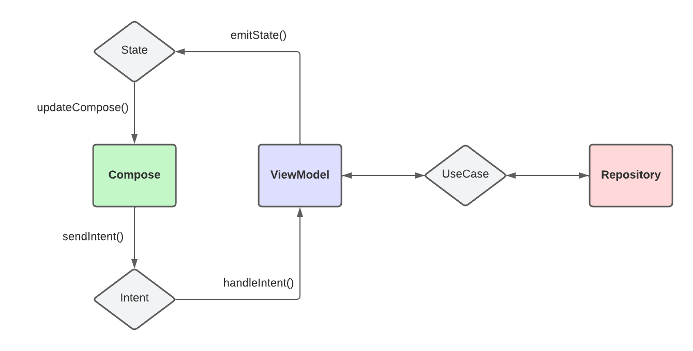
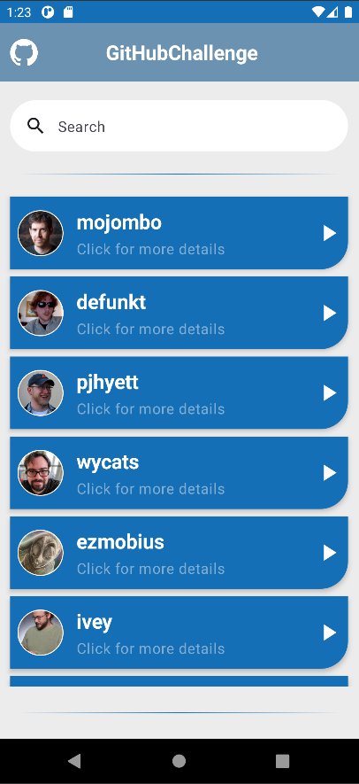
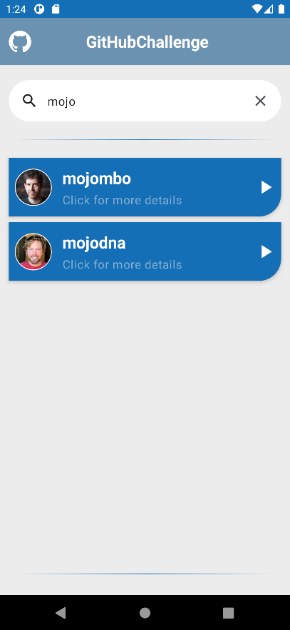
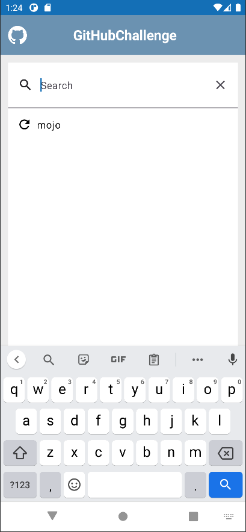
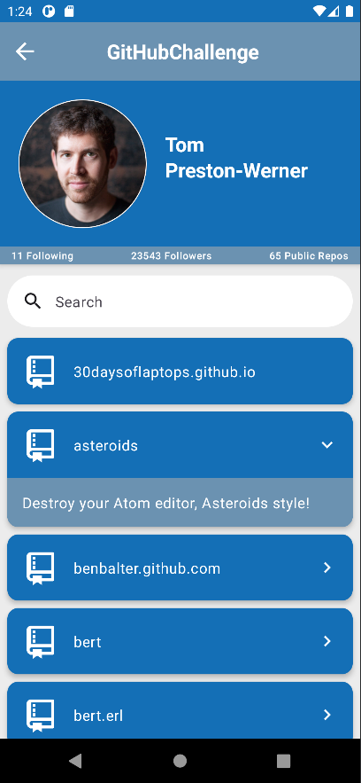
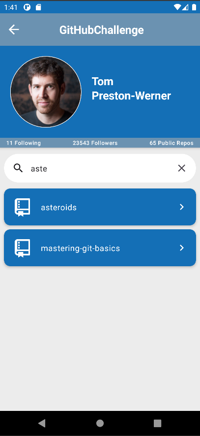

<h1 align="start">Git Hub Challenge</h1>


[](https://app.bitrise.io/app/cb1a04c9-abce-4d4e-85f4-5ae7d23726cf)

<h1 align="start">Sobre</h1>

O objetivo da aplicação é listar usuários utilizando a API gratuita do GitHub, com opção de filtrar a lista através da feature de busca, podendo também acessar informações mais detalhadas de um determinado usuário, clicando nele. Exemplos abaixo.

O projeto foi um pouco desafiador, pois nunca tinha trabalhado diretamente com a arquitetura MVI, compose e outras ferramentas utilizadas, mas acredito que tenha tomado as melhores decisões. Não tenho muito conhecimento sobre testes instrumentados, por isso consegui implementar apenas alguns exemplos mas esse é um desafio que decidi abraçar para os próximos projetos. Não tenho muita habilidade com UI/UX, mas tentei deixar o mais agradável possível.

<h1 align="start">Como executar</h1>
<p align="start">A execução do projeto é simples:</p>

```
- Clone este repositório; 
  $ git clone https://github.com/ViniGouveia/git-hub-challenge.git
  ou
  git@github.com:ViniGouveia/git-hub-challenge.git

- Abra o projeto no Android Studio;

- Aguarde a indexação dos arquivos (esse processo pode demorar alguns minutos, pela quantidade de dependências no projeto);

- Por fim, execute o projeto em um dispositivo físico ou virtual.
```

<p align="start">Para executar via terminal:</p>

```
Para a variante debug, utilizar o código:  
./gradlew clean app:assembleDebug  

Para a variante release, utilizar o código:  
./gradlew clean app:assembleRelease
```

<h1 align="start">Explicação da arquitetura</h1>

Na arquitetura do projeto, decidi focar no funcionamento e na manutenção do aplicativo, seguindo ao máximo os princípios SOLID e da Clean Architecture.

<p align="middle">
    
    <p style="text-align:center"><i>Essa é uma representação da arquitetura utilizada no projeto. Entre a classe Repository e a ViewModel existe a camada (não obrigatória) UseCase, responsável pelas regras de negócio e que faz comunicação com o Repository.</i></p>
</p>

<h1 align="start">Features</h1>

<p align="middle">
    
    <p style="text-align:center">Essa é uma representação da primeira tela que o usuário irá ver ao entrar na aplicação, listando os usuários retornados pela API.</p>
</p>

<p align="middle">
    
    <p style="text-align:center">Após realizar alguma busca, os usuários são filtrados e exibidos como no exemplo acima.</p>
</p>

<p align="middle">
    
    <p style="text-align:center">Essa é a tela onde são feitas as buscas no app. São exibidas as últimas buscas feitas pelo usuário. É possível limpar o campo e resetar a lista clicando no "x".</p>
</p>

<p align="middle">
    
    <p style="text-align:center">Essa é a tela onde são apresentadas as informações do usuário, assim como a listagem de seus repositórios públicos.</p>
</p>

<p align="middle">
    
    <p style="text-align:center">É possível filtrar a lista de repositórios através da search bar. É possível limpar o campo e resetar a lista clicando no "x".</p>
</p>

<h1 align="start">Continuous Integration</h1>

O projeto utiliza uma esteira no BitRise, que tem como funcionalidade executar os scripts de CI quando um Pull Request ou Push é criado. (apenas para develop e main)

<h3 align="start">Pull Request CI</h3>

A esteira faz uma análise estática do código, verificando se tudo está formatado consistentemente, se não possui erro na complexidade e se os testes unitários estão funcionando corretamente;

<h1 align="start">Algumas bibliotecas utilizadas</h1>

- Hilt (injeção de dependência);

- Retrofit (cliente de comunicação com web service);

- Jetpack Navigation (ferramenta para navegação entre as telas);

- Jetpack Compose (crianção da UI);

- Kotlin Coroutines (códigos assíncronos).
